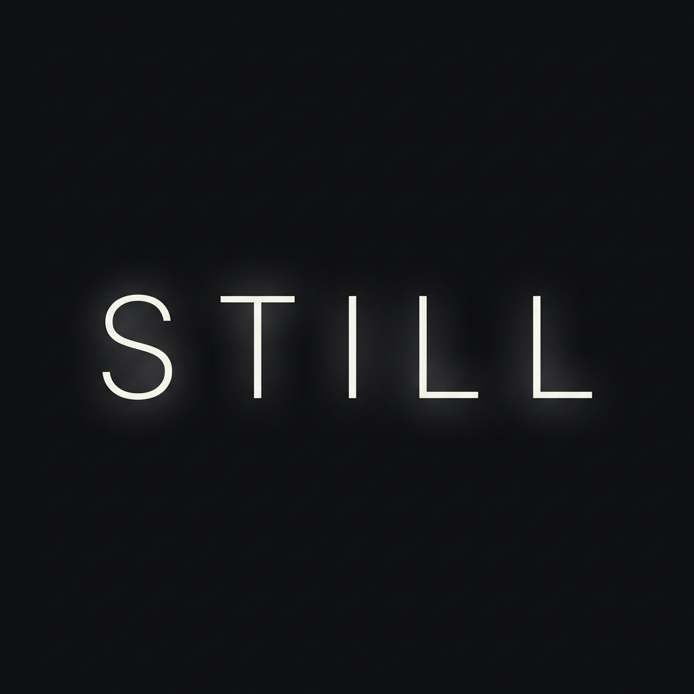
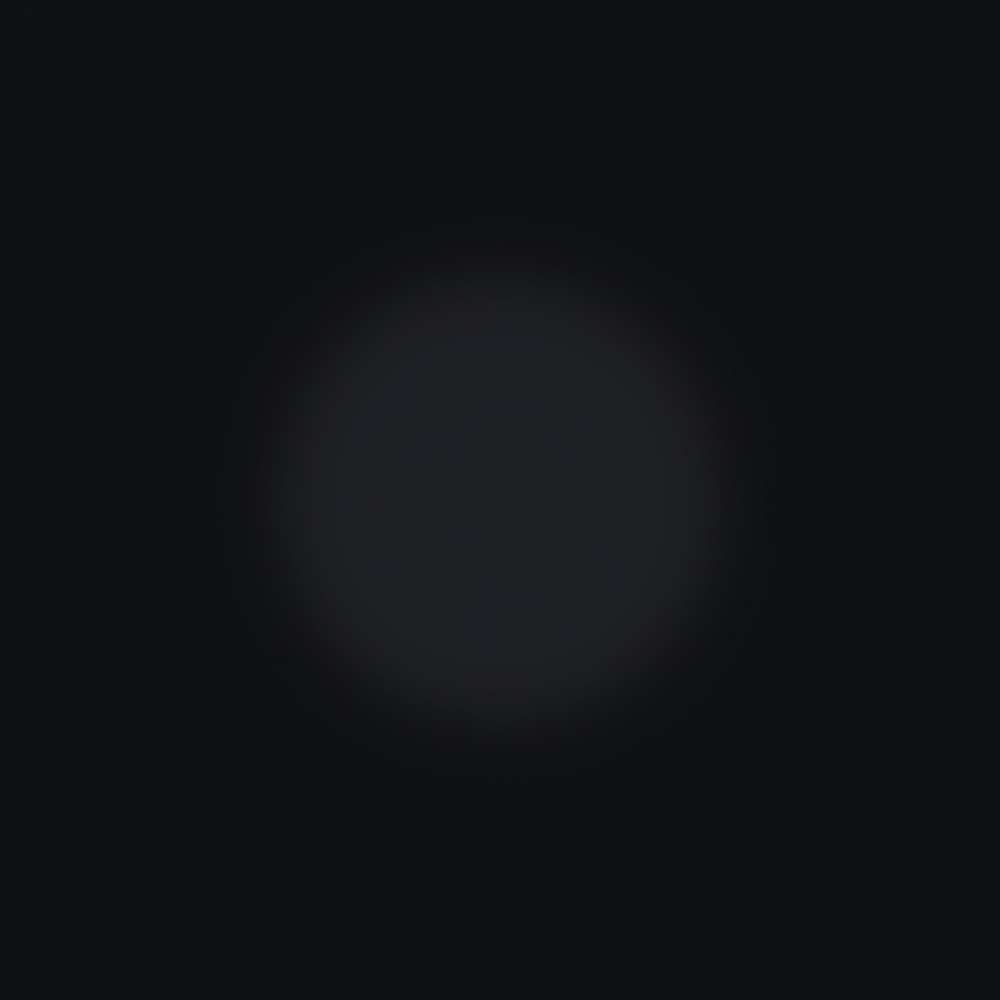

<p align="center">
  
</p>

<p align="center">
  <em>A space with no demand.</em>
</p>

<p align="center">
  
  
  
</p>

---

## Philosophy

**STILL** exists to remove input pressure.

Not to calm. Not to guide. Not to help.

Just: *"I am here, and nothing is required."*

If the user expects something to happen, the app has failed.

---

## ❌ What STILL Does NOT Have

| ❌ | Reason |
|---|--------|
| No goals | Nothing to achieve |
| No actions | Nothing to do |
| No text | After first launch |
| No timers | No time pressure |
| No stats | Nothing to track |
| No progress | Nothing to complete |
| No exit message | The app doesn't care if you leave |

---

## ✨ What STILL Has

| Feature | Behavior |
|---------|----------|
| **Adaptive Colors** | 2% hue shift based on time of day |
| **Color Breathing** | 5-minute imperceptible hue cycle |
| **Depth Parallax** | Tilt device → layers shift 1-2% |
| **Presence Glow** | Organic pulsing (not rhythmic) |
| **Micro Grain** | 1.5% film grain preventing digital flatness |
| **Whisper Events** | Random tone/flicker every 10-20 min |
| **Ambient Tone** | Optional 30-60Hz drone (4% volume) |

---

## 📱 Screenshots

<p align="center">
  
</p>

<p align="center">
  <em>The app icon matches the in-app presence glow.</em>
</p>

---

## 🛠️ Tech Stack

- **Flutter** 3.10+
- **Dart** 3.x
- **State Management**: Pure StatefulWidget
- **Persistence**: SharedPreferences (first-launch only)
- **Sensors**: Accelerometer for parallax
- **Audio**: AudioPlayers for ambient tone

---

## 📁 Project Structure

```
lib/
├── main.dart                    # Entry + immersive mode
├── app/
│   └── still_app.dart           # MaterialApp configuration
├── core/
│   ├── app_colors.dart          # Adaptive color palette
│   └── app_durations.dart       # Animation timings
├── screens/
│   ├── first_launch_screen.dart # One-time "STILL" intro
│   └── still_screen.dart        # The empty space
├── services/
│   ├── ambient_tone_service.dart
│   └── whisper_event_service.dart
└── widgets/
    ├── subtle_gradient.dart     # Color breathing + parallax
    ├── micro_grain.dart         # Film grain overlay
    └── presence_glow.dart       # Organic glow
```

---

## 🚀 Getting Started

### Prerequisites

- Flutter 3.10 or higher
- Dart 3.x

### Installation

```bash
# Clone the repository
git clone https://github.com/yourusername/still.git

# Navigate to project
cd still

# Install dependencies
flutter pub get

# Run the app
flutter run
```

### Optional: Audio Assets

For the ambient tone and whisper events, add these files to `assets/audio/`:

| File | Description |
|------|-------------|
| `ambient_tone.mp3` | 30-60Hz low drone (loops) |
| `whisper_tone.mp3` | Single soft whisper (~1-2s) |

The app works without these files — audio features silently fail if missing.

---

## 🎨 Design Tokens

### Colors

| Token | Hex | Usage |
|-------|-----|-------|
| Background Base | `#0E0F12` | Primary background |
| Depth Overlay | `#14151A` | Subtle layering |
| Highlight | `#1B1C22` | Gradient edges |
| Text Primary | `#FFFFFF` @ 90% | First-launch text |

### Timings

| Animation | Duration |
|-----------|----------|
| Gradient Drift | 60 seconds |
| Color Breathing | 5 minutes |
| Presence Glow | 18 seconds |
| Whisper Events | 10-20 minutes (random) |

---

## 🧪 Success Criteria

STILL is successful if:

- ✅ Users open it and don't know what to do
- ✅ Users don't feel confused — just neutral
- ✅ Users don't talk about features
- ✅ Users forget time without being told

If someone asks: *"What am I supposed to do?"*

Answer: *"Nothing."*

---

## 📄 License

```
MIT License

Copyright (c) 2026

Permission is hereby granted, free of charge, to any person obtaining a copy
of this software and associated documentation files (the "Software"), to deal
in the Software without restriction, including without limitation the rights
to use, copy, modify, merge, publish, distribute, sublicense, and/or sell
copies of the Software, and to permit persons to whom the Software is
furnished to do so, subject to the following conditions:

The above copyright notice and this permission notice shall be included in all
copies or substantial portions of the Software.

THE SOFTWARE IS PROVIDED "AS IS", WITHOUT WARRANTY OF ANY KIND, EXPRESS OR
IMPLIED, INCLUDING BUT NOT LIMITED TO THE WARRANTIES OF MERCHANTABILITY,
FITNESS FOR A PARTICULAR PURPOSE AND NONINFRINGEMENT. IN NO EVENT SHALL THE
AUTHORS OR COPYRIGHT HOLDERS BE LIABLE FOR ANY CLAIM, DAMAGES OR OTHER
LIABILITY, WHETHER IN AN ACTION OF CONTRACT, TORT OR OTHERWISE, ARISING FROM,
OUT OF OR IN CONNECTION WITH THE SOFTWARE OR THE USE OR OTHER DEALINGS IN THE
SOFTWARE.
```

---

<p align="center">
  <em>Nothing is required.</em>
</p>
